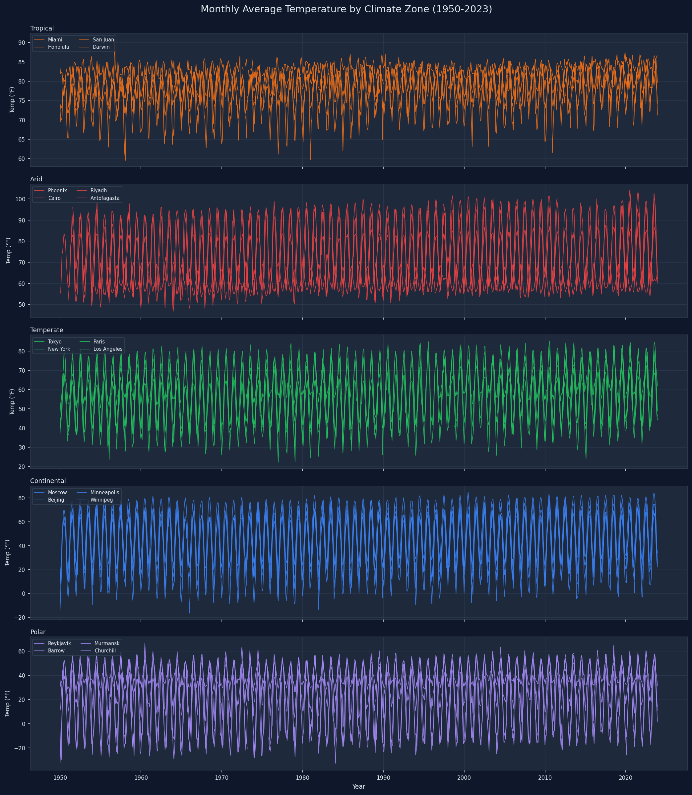
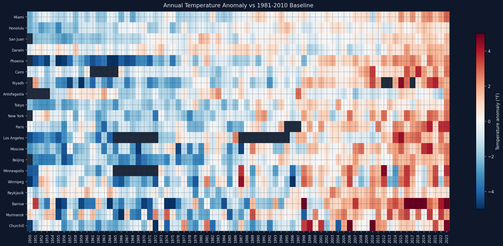
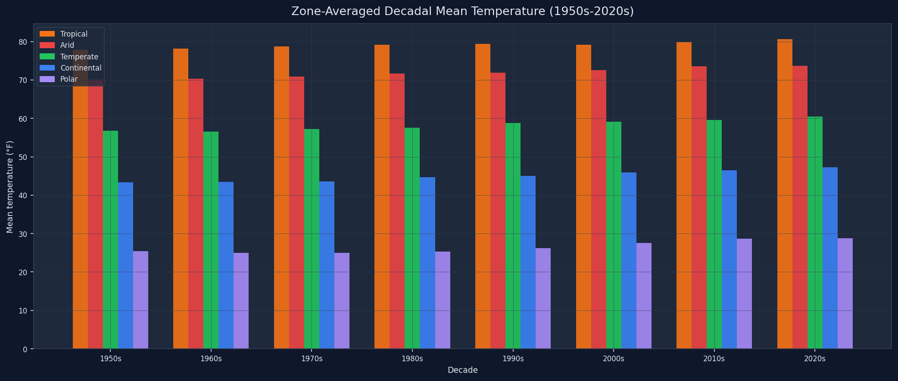

# Climate Station Analysis

A time series analysis of temperature trends across 20 cities in 5 climate zones, using NOAA Global Historical Climatology Network (GHCN) data from 1950 to 2023.

Part of my [35-project AI Engineering Roadmap](https://ai-engineer-roadmap-ee841.web.app/projects).

---

## What it does

- Fetches monthly temperature records for 20 cities across tropical, arid, temperate, continental, and polar zones
- Selects the best-coverage station from the 15 nearest candidates for each city, since the geographically closest station is often not the one with the most complete historical record
- Converts all temperatures to Fahrenheit and flags missing months explicitly as Not a Number (NaN) rather than interpolating
- Detects outlier months using z-scores relative to each city's full record
- Computes temperature anomalies against the 1981-2010 World Meteorological Organization (WMO) baseline period
- Produces three dark-themed plots: monthly time series by zone, an anomaly heatmap, and decadal zone averages
- Spot-checks annual averages against published NOAA normals to verify the data is sensible

---

## Cities

Each city was verified to have at least 85% data coverage from 1950 to 2023 before being included.

| Zone | Cities |
|---|---|
| Tropical | Miami, Honolulu, San Juan, Darwin |
| Arid | Phoenix, Cairo, Riyadh, Antofagasta |
| Temperate | Tokyo, New York, Paris, Los Angeles |
| Continental | Moscow, Beijing, Minneapolis, Winnipeg |
| Polar | Reykjavik, Barrow, Murmansk, Churchill |

---

## Project structure

```
geoai-climate-station-analysis/
├── analysis.py        # data fetching, Fahrenheit conversion, anomaly detection, decadal trends
├── visualize.py       # time series plots, anomaly heatmap, decadal trend chart
├── cities.py          # 20-city configuration with coordinates and climate zones
├── requirements.txt
├── tests/
│   └── test_analysis.py
└── plots/             # generated charts
```

---

## Setup

```bash
pip install -r requirements.txt
```

No API key is required. The `meteostat` library fetches GHCN data directly from NOAA's public servers.

---

## Running the analysis

```bash
python analysis.py
```

Sample output:

```
Fetching climate data for 20 cities across 5 climate zones...

  fetching Miami (tropical)...
  fetching Honolulu (tropical)...
  ...

Summary:
  City           Zone           Missing months   Outliers
  -------------- -------------- -------------- ----------
  Miami          tropical                    0         23
  Honolulu       tropical                    0          2
  ...
```

To generate all three plots:

```bash
python visualize.py
```

Plots are saved to `plots/`:
- `temperature_timeseries.png` — monthly average temperature by zone, 1950-2023
- `anomaly_heatmap.png` — annual temperature anomaly vs the WMO baseline, one row per city
- `decadal_trends.png` — zone-averaged mean temperature by decade

---

## Results

**Monthly temperature by climate zone (1950-2023)**



**Annual temperature anomaly vs 1981-2010 baseline**



**Zone-averaged decadal mean temperature**



---

## What I learned

The station selection piece was the most surprising part. My first instinct was to just take the geographically nearest station for each city, and that worked fine for US and European cities with dense networks. For cities like Los Angeles and several polar stations, the nearest station had almost no historical data before 2000. Checking the 15 nearest candidates and picking the one with the most complete record fixed the gaps without requiring any manual configuration.

The anomaly heatmap is the most informative of the three charts. Every climate zone shows a visible shift from negative anomalies (blue) to positive anomalies (red) starting somewhere between the 1980s and 2000s. The polar cities show the largest anomalies, which I expected after reading about Arctic amplification, but seeing it consistently across Barrow, Murmansk, Churchill, and Reykjavik made it concrete. The 2020s column is almost entirely red across every zone.

The outlier detection uses z-scores. A z-score measures how far a data point is from the mean in units of standard deviation. A z-score of 0 means perfectly average. A z-score of 2 means two standard deviations above average, which is unusual but not impossible. I flag any month with an absolute z-score above 2.0 as an outlier.

The limitation is that the mean and standard deviation are computed across all months in the full record, mixing all twelve calendar months together. That makes the threshold too lenient in summer and too strict in winter for cities with large seasonal swings. A 75°F February in Moscow would be a massive outlier, but a 75°F August would not. Both get measured against the same baseline here. A cleaner approach would compute a separate z-score for each calendar month. I left it as-is for simplicity.

The spot-check against published NOAA normals all came back within 4°F. Miami averaged 76.7°F against a published normal of 77°F, and Barrow averaged 11.6°F against a published normal of 11°F. The small differences make sense because our record spans 1950-2023 while published normals use 1991-2020, so the older and cooler pre-warming decades pull our long-run averages slightly lower.

---

## Tests

```bash
pytest tests/
```

Three tests cover the core math: anomaly baseline subtraction, outlier detection, and warming trend direction. All run without network access. For full data verification, run `python analysis.py`.

---

## Dataset

NOAA Global Historical Climatology Network (GHCN) via the [meteostat](https://dev.meteostat.net/) Python library. Data is available under NOAA's open data policy.
